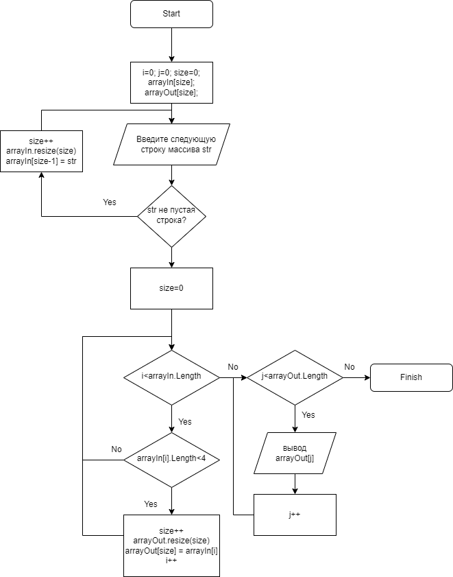

# Итоговая проверочная работа

**Задача:** Написать программу, которая из имеющегося массива строк формирует массив из строк, длина который меньше или равна 3 символа. Первоначальный массив можно ввести с клавиатуры, либо задать на старте выполнения алгоритма.

## Блок-схема

**Описание решения**
Для решения задачи использован язык программирования С#.
1. Первый метод GetArrayFromUser принимает от пользователя элементы входного массива по одному.
2. Второй метод GetFilteredArray проходит по всем элементам введенного массива и отбирает элементы, длина которых меньше или равна 3 символам в новый массив.
3. Последний метод  PrintArray выводит отфильтрованный массив.